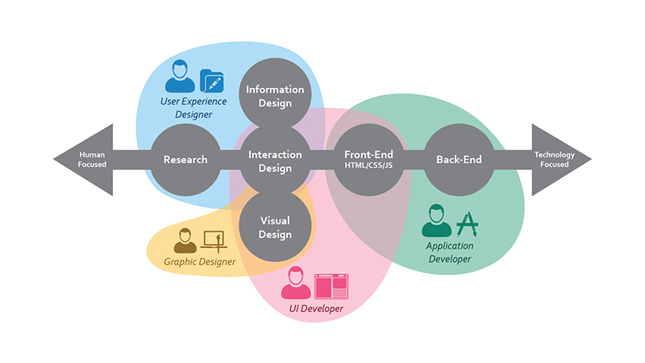
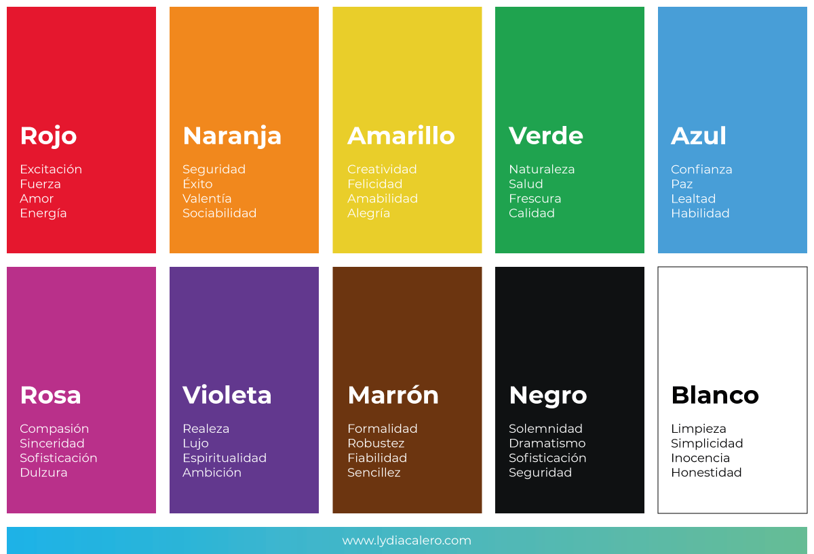
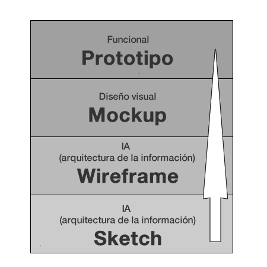

# Presentación Conceptos de Usabilidad - TD GX

El siguiente documento tiene como objetivo presentar conceptos basicos de diseño y usabilidad con el fin de que el estudiante de Front-end adquiera estos skill.

## Primero, nuestro campo de desarrollo:

Flujo de área

## Psicologia del color

[Psicologia del Color](https://medium.com/@nubogroup/el-impacto-de-la-psicolog%C3%ADa-del-color-en-tu-marca-e0f9b0131698 "Psicologia del color")

## Principios basicos de Diseño Principios de Gestal

Gestalt es una palabra alemana que no tiene traducción directa al castellano pero que viene a significar “Forma, Estructura y Totalidad” y hace referencia a una corriente psicológica surgida en Alemania a principios del siglo XX. 

Por ello, cuando hablamos de los principios de Gestalt también estamos hablando de la psicología de las formas y su estructura.

La mente configura, a través de ciertas leyes, los elementos que llegan a ella a través de los canales sensoriales (la percepción) o de la memoria (pensamientos, inteligencia y resolución de problemas). 

La frase “El todo es mayor que la suma de las partes” se utiliza a menudo para explicar la teoría de la Gestalt. Empleamos estos principios en la mayoría de los aspectos de nuestra vida cotidiana. 
Ellos, tanto física como conceptualmente, componen nuestra experiencia. 

Proximidad: los elementos que se sitúan cerca el uno del otro son percibidos como más relacionados que los que sitúan más apartados.

Región común: los elementos agrupados en una región común son percibidos.

Similaridad: elementos que tienen características iguales visualmente son percibidos como más relacionados que aquellos que no.

Cierre: un grupo de elementos son a menudo percibidos como una sola forma o figura. Esto ocurre incluso cuando está incompleta o partes de ella no están comprendidas en ella.

Simetría: elementos simétricos tienden a ser percibidos como pertenecientes a lo mismo, no importa su distancia, dándonos sensación de orden y solidez.

Continuidad: los elementos que se perciben como pertenecientes a una línea (sea recta o curva).

Destino común: los elementos que siguen una misma dirección son percibidos como más relacionados que aquellos que se mueven en otras direcciones o no se mueven.

## Principios Gestalt aplicados al diseño de interfaces

Proximidad: como hemos dicho los usuarios tenderán a agrupar los elementos más cercanos, por tanto tendremos que dividir la superficie visible en elementos similares o dividirlos en regiones. Por ello el espacio en blanco juega un papel fundamental a la hora de diseñar interfaces y debes mantener una coherencia para lograr una jerarquía visual

Región común: en este caso podemos usar la forma o el color para dividir el interfaz en regiones, las cuales usaremos para construir las diferentes parte de un interfaz: menú de navegación, barra de herramientas, contenido, barras laterales, etc…

Similaridad: el ejemplo más común del principio de similaridad en interfaces  sería el diseño de tarjetas para dividir los contenidos en muchos productos digitales o las disposiciones en forma de rejilla de los contenidos en muchos productos digitales.

Cierre: este principio se usa para diseñar los iconos simples que se usan para los interfaces ya que cuanto más sencilla e icónica la forma mejor se reconoce y menor carga cognitiva tiene.

Simetría: los elementos simétricos son más agradables y armoniosos visualmente hablando. Además dan sensación de orden y estabilidad. La simetría es útil para mostrar información de forma rápida y eficiente. La simetría se puede usar en portfolios, galerías de imágenes, listados y cualquier otro elemento de contenido puro y duro.

Continuidad: el ejemplo de continuidad más evidente son los elementos de un menú de navegación móvil, sobre todo los horizontales que pasas elementos con el dedo. Para ello se usa este principio usando un alineamiento lineal en filas o columnas para que el usuario le sea más fácil ver ese elemento como un todo.

Destino común: aunque parezca que es el principio más difícil, en realidad es muy usual en el diseño de interfaces en elementos como los menús de navegación desplegables y navegables, las migas de pan o los pasos de un proceso.

# Proceso previo al codigo

## Sketch, wireframe,mockup y prototipos.

### ¿Qué es un Sketch?

Primeros pasos sobre papel, el sketch es el dibujo a mano alzada en donde diseñamos la idea base de una web.

[Uso de Markdown](https://github.com/adam-p/markdown-here/wiki/Markdown-Cheatsheet "Markdown Cheatsheet")